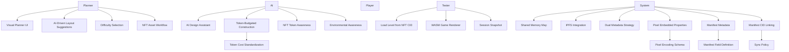

# 🧭 Requirements Overview

```mermaid
graph TD
  %% Personas
  P1[Planner]
  P2[Tester]
  P3[Player]
  P4[AI]

  %% Planner Requirements
  P1 --> P1F01[Visual Planner UI]
  P1 --> P1F02[AI-Driven Layout Suggestions]
  P1 --> P1F10[Difficulty Selection]
  P1 --> P1F09[NFT Asset Workflow]

  %% AI Requirements
  P4 --> P4F01[AI Design Assistant]
  P4 --> P4F04[Token-Budgeted Construction]
  P4 --> P4F05[NFT Token Awareness]
  P4 --> P4F03[Environmental Awareness]

  %% Tester Requirements
  P2 --> P2F01[Load Level from NFT CID]
  P2 --> P2F02[WASM Game Renderer]
  P2 --> P2F06[Session Snapshot]

  %% System Requirements
  SYS[System]
  SYS --> SYSF01[Shared Memory Map]
  SYS --> SYSF02[IPFS Integration]
  SYS --> SYSF05[Dual Metadata Strategy]
  SYS --> SYSF06[Pixel Embedded Properties]
  SYS --> SYSF07[Manifest Metadata]
  SYS --> SYSF08[Manifest CID Linking]

  %% Open Topics
  OT03[Token Cost Standardization]
  OT06[Manifest Field Definition]
  OT07[Pixel Encoding Schema]
  OT08[Sync Policy]

  %% Links to open topics
  P4F04 --> OT03
  SYSF07 --> OT06
  SYSF06 --> OT07
  SYSF08 --> OT08
```

Start exploring by reading the individual persona and requirement files.
